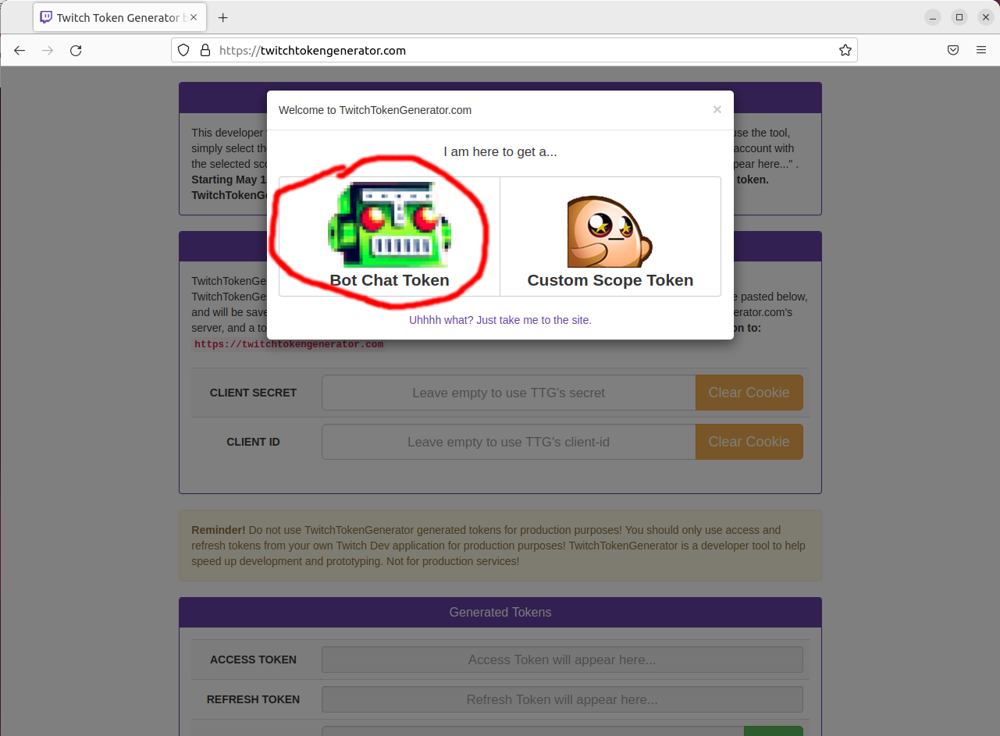
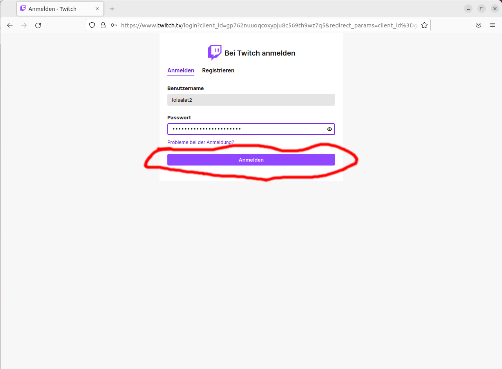
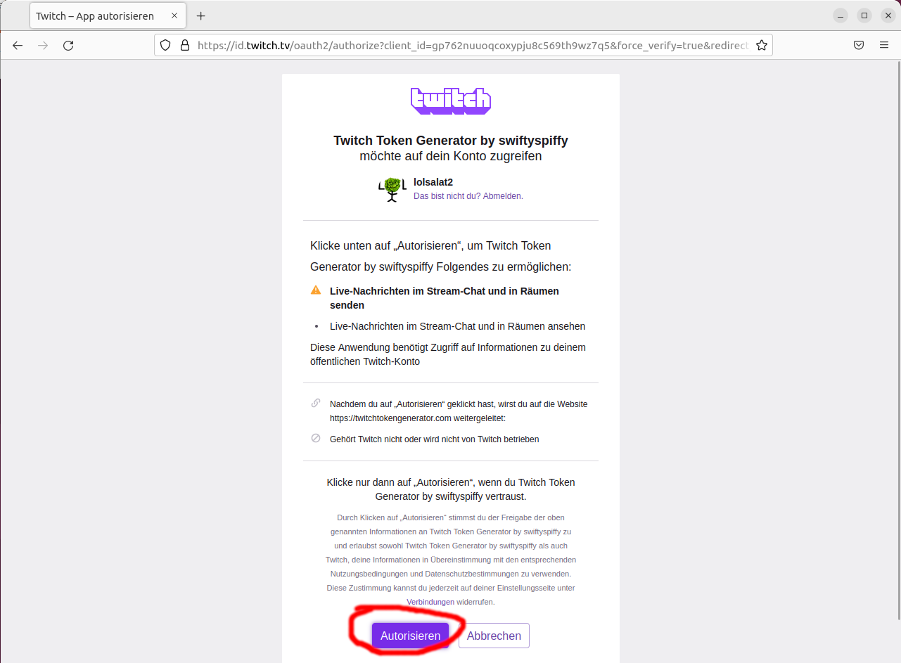
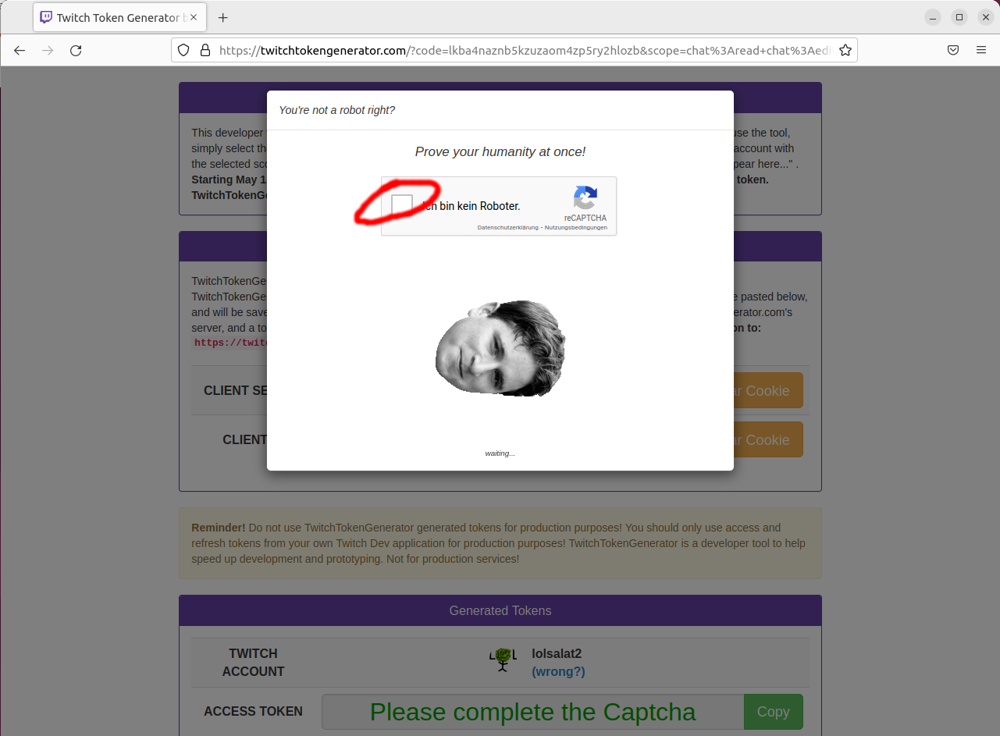
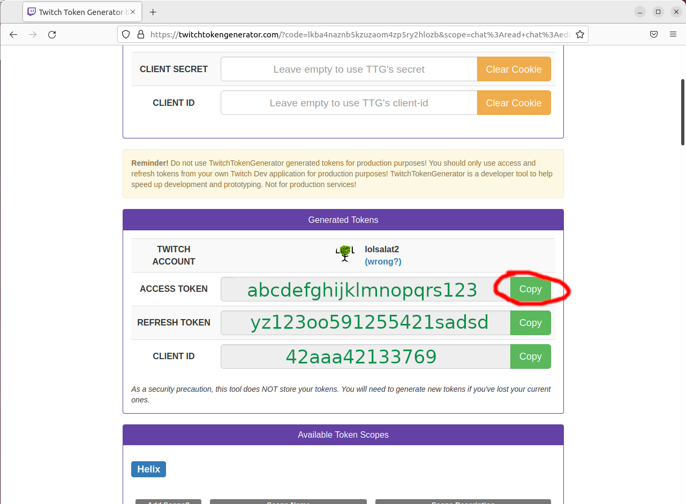

# Einen Access Token bekommen
Es gibt mehrere Möglichkeiten an einen access Token zu kommen.
Entweder man erstellt eine eigene App [Link](https://dev.twitch.tv/docs/authentication/register-app), man benutzt das Twitch Commandozeile Tool [Link](https://dev.twitch.tv/docs/cli), oder man benutzt die Website [twitchtokengenerator.com](https://twitchtokengenerator.com/).
Hier wird letzteres beschrieben, da es am einfachsten ist.

## Einen Access Token bekommen mit twitchtokengenerator.com
Für manche Schritte gibt es einen Screenshot. 
Um Platz zu sparen ist er eingeklappt und kann durch klicken auf `Bild anzeigen` ausgeklappt werden.

0. Gehe auf [twitchtokengenerator.com](https://twitchtokengenerator.com/)
1. Drücke auf `Bot Chat Token` (Notiz: Sobald die Twitch API auch in den Bot eingebaut ist, genügt ein `Bot Chat Token` nicht mehr um alle Features zu benutzen. Dann wird diese Seite angepasst werden)
    

      
Bild anzeigen

      
    

2. Logge dich mit deinem Twitch account ein
    

      
Bild anzeigen

      
    
 
3. Authorisiere die App von twitchtokengenerator.com
    

      
Bild anzeigen

      
    
 
4. Löse das Captcha
    

      
Bild anzeigen

      
    
 
5. Kopiere den Access Token (und schreibe ihn in die Datei `token.txt`).
    

      
Bild anzeigen

      
    
 
6. Herzlichen Glückwunsch, du bist bereit den Bot zu benutzen!
